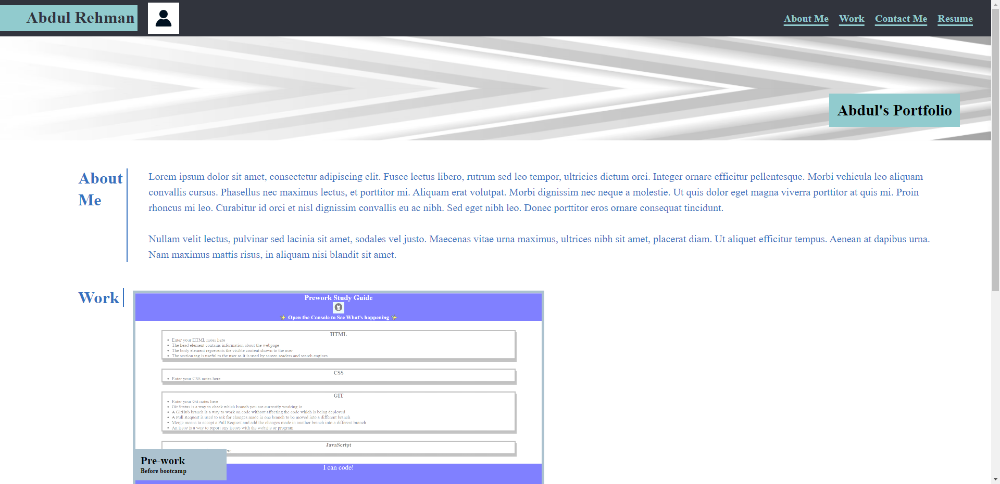
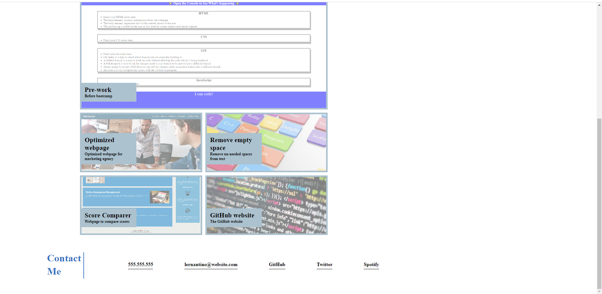
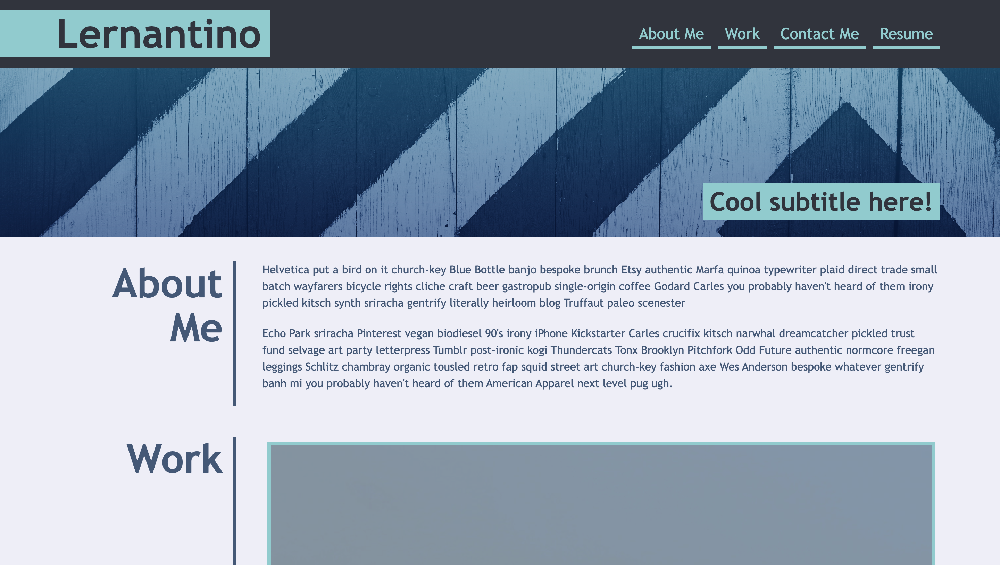
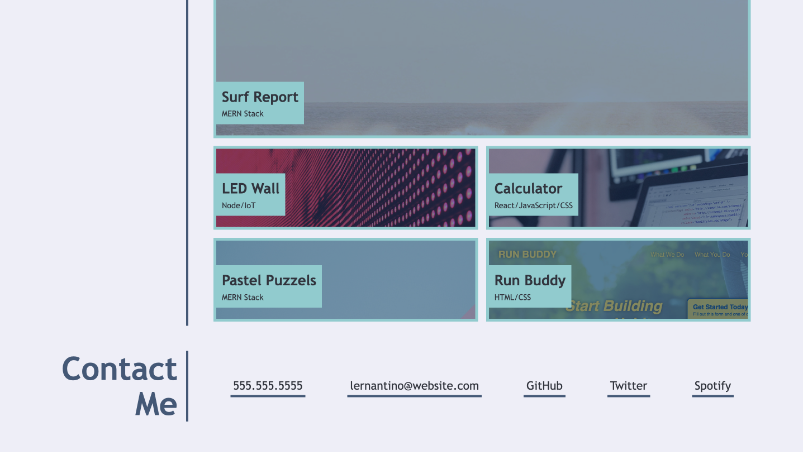

# Portfolio Website

## Table of Contents
* [Screenshot of page](#screenshot)
* [Information](#information)
* [Installation](#installation)
* [Credits](#credits)
* [License](#license)
* [Tests](#tests)

## Screenshot

## Information
This page was given to me by the edX bootcamp: Skills Boot Camp in Front-End Web Development
My task was to create a webpage similar to this webpage:  

## Installation
Click on this link: https://programmer90000.github.io/portfolio-website/

## Credits
The original page which I copied was from the edX bootcamp: Skills Boot Camp in Front-End Web Development

## License
GNU GENERAL PUBLIC LICENSE (GPL) version 3.0

## Tests
Click on each individual Anchor Link and ensure it moves to the correct part of the page